# 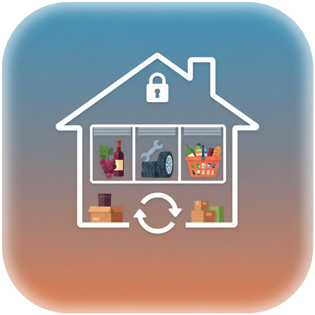 I Miei Magazzini

**I Miei Magazzini** è un'applicazione moderna e intuitiva per la gestione dell'inventario domestico. Progettata per aiutarti a tenere traccia di prodotti, scadenze e quantità in modo semplice, l'app offre un'esperienza fluida sia su dispositivi mobili (Android) che come Web App (PWA).

L'applicazione segue un approccio **Local-First**, garantendo un'interfaccia reattiva grazie alla cache locale e alla sincronizzazione in background con un database basato su **Google Sheets**.

---

## 🚀 Funzionalità Principali

- 📦 **Gestione Inventario**: Aggiungi, modifica, duplica ed elimina prodotti con facilità.
- 📉 **Controllo Quantità**: Aggiornamento rapido delle quantità con feedback visivo immediato (Ottimistic UI).
- 📅 **Monitoraggio Scadenze**: Sistema di avviso automatico per prodotti in scadenza o già scaduti.
- 📂 **Organizzazione**: Suddivisione dei prodotti per **Categorie** e **Posizioni** (es. Dispensa, Frigo, Garage).
- 🔍 **Filtri Avanzati e Ricerca**: Trova istantaneamente ciò che cerchi filtrando per posizione, stato dello stock (esaurito, disponibile) o tramite ricerca testuale.
- 📊 **Dashboard Statistiche**: Visualizzazione grafica della distribuzione dei prodotti per categoria e stato attraverso grafici interattivi.
- 🌓 **Tema Chiaro/Scuro**: Supporto completo alla modalità dark per un comfort visivo ottimale.
- 🔄 **Sincronizzazione Cloud**: Integrazione con Google Sheets per mantenere i tuoi dati al sicuro e sincronizzati su più dispositivi.
- 📶 **Supporto Offline**: Continua a lavorare anche senza connessione; le modifiche verranno sincronizzate non appena tornerai online.

---

## 📱 Screenshot

  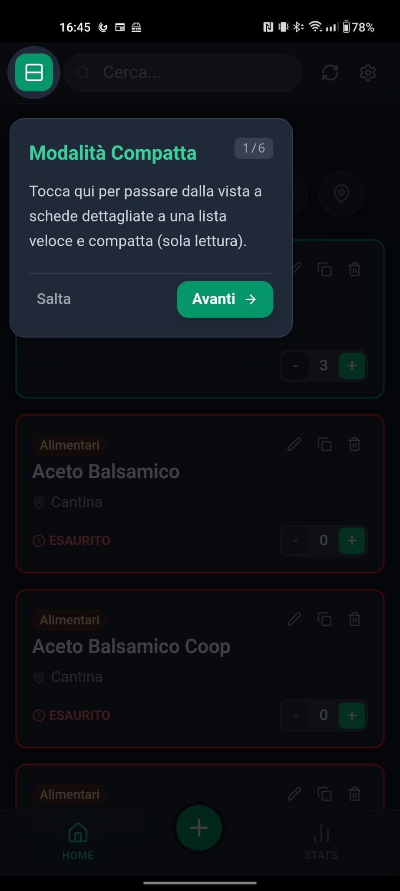
  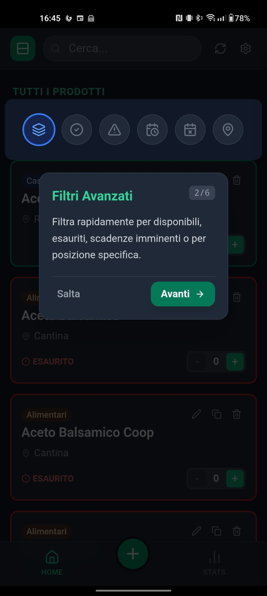
  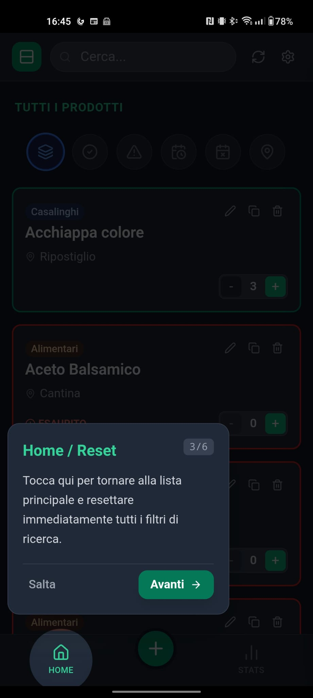

  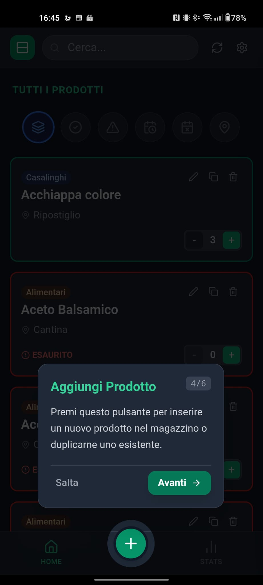
  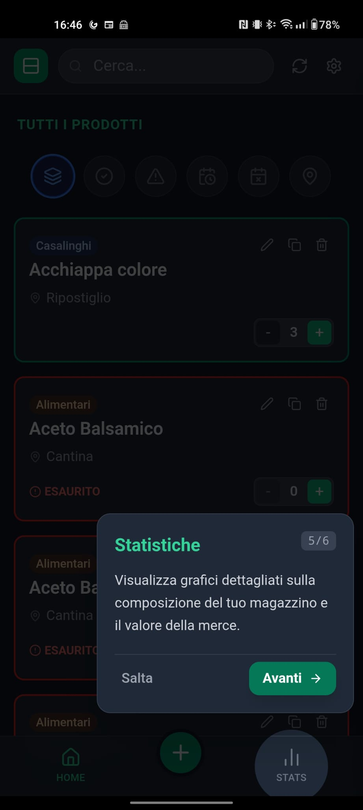
  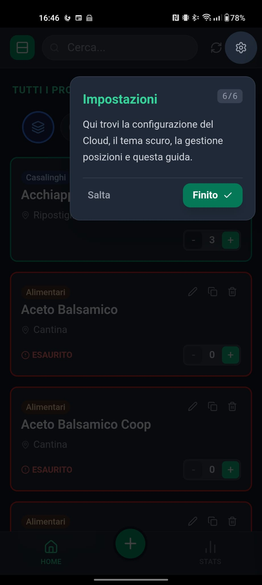

  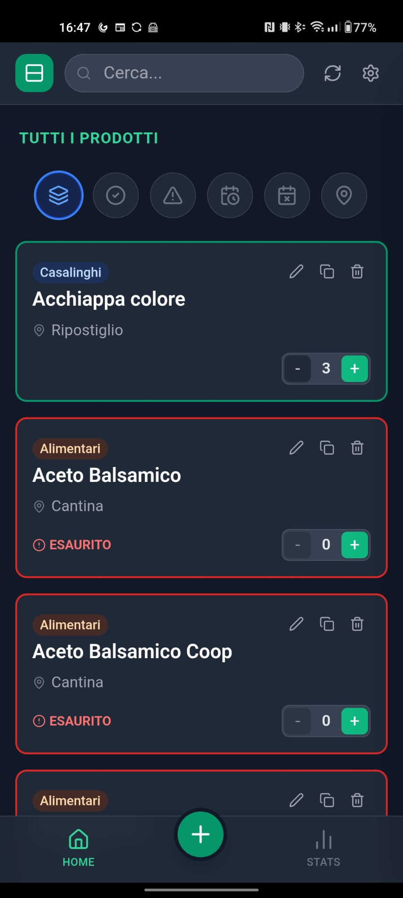
  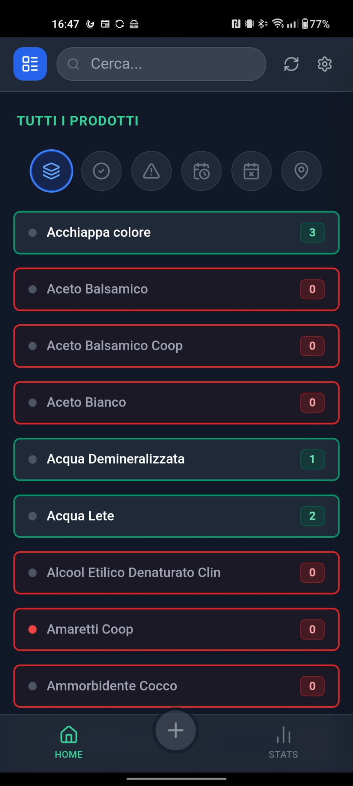
  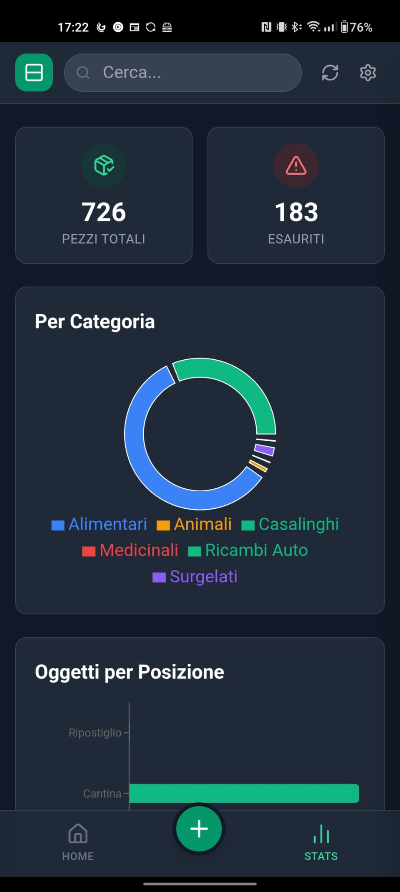

  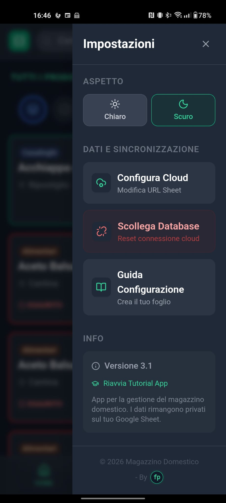
  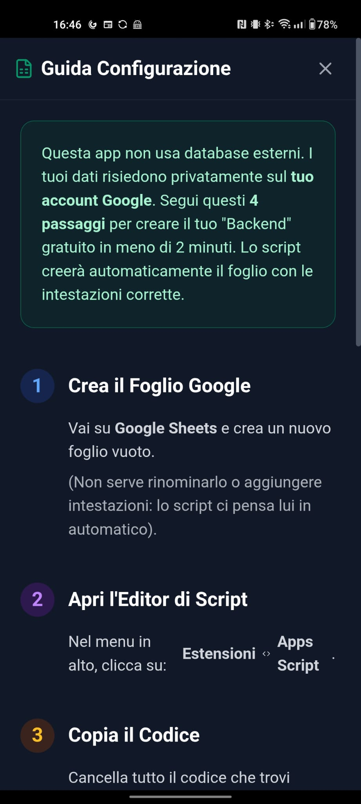

---

## 🛠️ Tecnologie Utilizzate

- **Frontend**: React 19, TypeScript, Vite.
- **Styling**: Tailwind CSS.
- **Icone**: Lucide React.
- **Grafici**: Recharts.
- **Mobile**: Capacitor 8.3 (Android).
- **Service Worker**: Supporto PWA per installazione su homescreen e uso offline.
- **Backend**: Integrazione con Google Sheets API.

---

## ⚙️ Configurazione

L'app richiede l'URL di un'API (solitamente uno script Google Apps Script) per sincronizzare i dati con un foglio Google.

1. Al primo avvio, segui la **Guida alla Configurazione** inclusa nell'app.
2. Inserisci l'URL del tuo database nelle impostazioni.
3. Inizia a gestire il tuo magazzino!

---

© 2026 - Sviluppato con ❤️ per una gestione domestica più intelligente.
